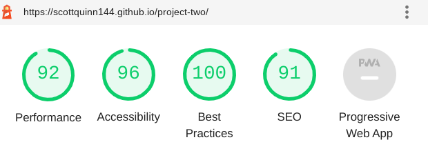
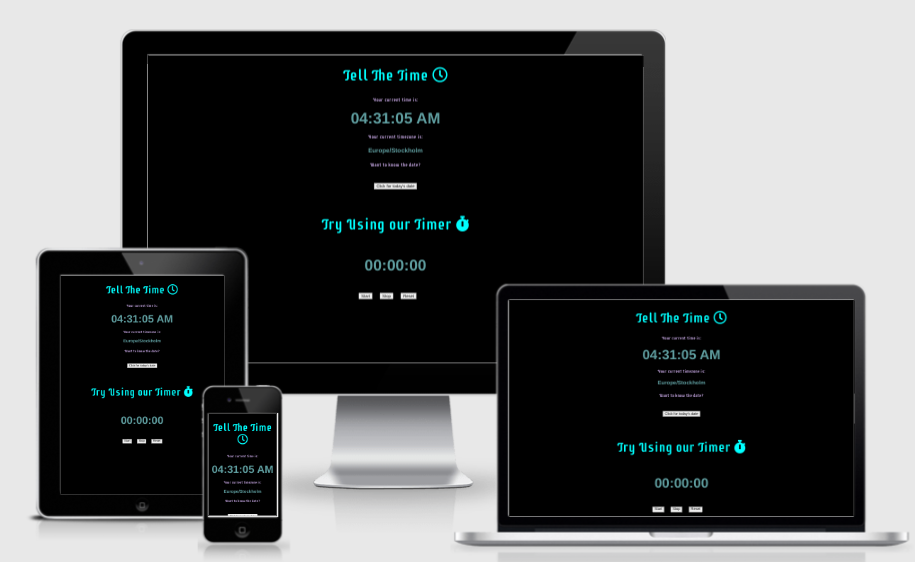

# **Tell The Time**
This simple yet effective clock and timer tells you the current time and timezone you are in as well as a handy stopwatch. Time is my theme for this application.
The `Tell The Time` web application is useful to everyone and is a fair representation of my limited yet expanding knowledge in Javascript. The set up is minimal which allows for maximizing loading speeds and useability.  

## **Testing**

HTML and CSS testing was done through `W3C` validators.
JavaScipt testing was done via `JSHint`.

- [Main Page](index.html) has issues.

- [CSS stylesheet](assets/css/style.css) has no issues.

- [JavaScript](assets/javascript/script.js) has no issues.

Special thanks go to the developer's personal friend 'Lucky' in Austria who
helped test the clock's timezone function and confirmed it worked.

## **Lighthouse Score**

## **Responsive Design**

## **Features**

### JavaScipt

There are three man areas in my script.
- the clock and timezone
- the date
- the timer

Although this was a very challenging project to complete, breaking each section of my 
page into these three categories helped me focus on each individual function and it's purpose.
 

### HTML and CSS
Basic, simply to follow and effective. My goal was to create effective and clean code in the shortest possible code. This optimization is a skill I am learning and this project begins this operation. 

## **Bugs**
<ul>
<li>I fixed aspects of my script that were a struggle. I have labelled this in the commit history.</li>
<li>Different spelling errors and minor things were caught as the code was written</li>
</ul>

The biggest bug was after my clock and timezone was complete I decided that the page would most likely fail my critiria ( the page was not interactive enough). To counter this and continue my `Tell The Time` theme, I added a timer as well. The timer took extra learning from my workplace which is credited below.

## **Deployment**
- I deployed my site on GitHub pages. I followed instructions from [Code Institue](https://codeinstitute.net/se/5-day-coding-challenge/?utm_term=code%20institute&utm_campaign=CI+-+SWE+-+Search+-+Brand&utm_source=adwords&utm_medium=ppc&hsa_acc=8983321581&hsa_cam=14660337051&hsa_grp=134087657984&hsa_ad=546251838233&hsa_src=g&hsa_tgt=kwd-319867646331&hsa_kw=code%20institute&hsa_mt=e&hsa_net=adwords&hsa_ver=3&gclid=Cj0KCQiA15yNBhDTARIsAGnwe0UQv6qv0SwHT3sAGJ6uF8SdJR6nThPCUkVs_yMLPFdVaHSEq1RtzB8aAtAuEALw_wcB) and deployed my site.
- My deployed site url: [Click Here](https://scottquinn144.github.io/project-two/)

## **Credits**

 # NTI Gymnasium (Gothenburg Sweden) 
 The amazing staff and students who I work with everyday at this I.T school 
 helped me select the clock idea as a great first JavaScript project. After this it was the students who tested and agreed a timer would make this more interactive. I used the library to research what functions would be required and build the site from there. I credit the school for topic selection and support when I was frustrated.

# Code Institute
This project is a projection of the learning material learnt on Code Institute's learning platfom. 

## **Disclaimer**

This site was built for educational purposes only, all rights to the title name, clock  or timer idea remain with the copyright owners. `Tell The Time` is a fictional creation of the developer. 

Developer: Scott Quinn

